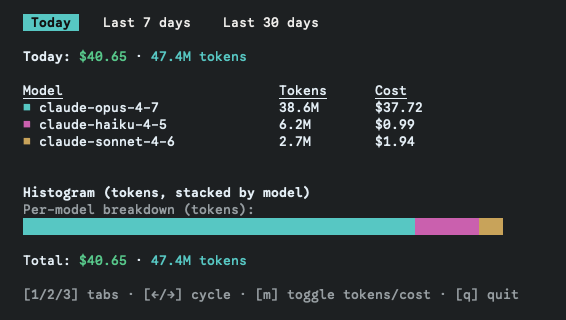
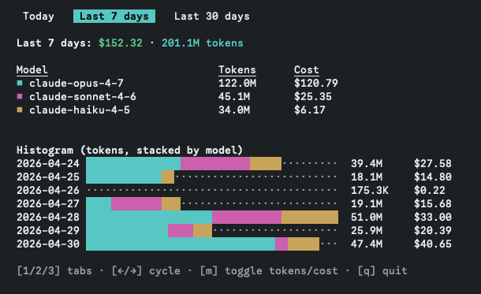

# oh-my-tokens

> Terminal UI for visualizing your Claude Code token usage and cost — entirely offline, from your local CLI logs.

`oh-my-tokens` scans the JSONL session logs that the Claude Code CLI writes to disk, aggregates them per day and per model, applies a local pricing table, and renders an interactive TUI with tabs (Today / Last 7 days / Last 30 days), a stacked horizontal bar histogram (segments colored per model), and a USD breakdown.

No network calls. No API keys. The numbers are computed from your own log files only.

---

## Table of Contents

- [Features](#features)
- [Limitations](#limitations)
- [Screenshots](#screenshots)
- [Requirements](#requirements)
- [Installation](#installation)
  - [Run from source](#run-from-source)
  - [Global install (link)](#global-install-link)
- [Usage](#usage)
- [Keybindings](#keybindings)
- [How it works](#how-it-works)
- [Configuration](#configuration)
- [Project layout](#project-layout)
- [Updating the price table](#updating-the-price-table)
- [Troubleshooting](#troubleshooting)
- [Contributing](#contributing)
- [License](#license)

---

## Features

- **Three time windows** as tabs: Today, Last 7 days, Last 30 days.
- **Stacked bar histogram** — one row per day, each segment colored per Claude model.
- **Tokens or cost view** — toggle the metric live with `m`.
- **Per-model summary table** — total tokens and USD per model in the active window.
- **Sonnet 4.x tiered pricing** — automatic 200k-token threshold split per token bucket.
- **Cross-file streaming dedup** — collapses cumulative streaming chunks by `(message.id, requestId)`, prefers parent over subagent and non-sidechain over sidechain rows.
- **Pure local computation** — no Anthropic API calls, works offline.

## Limitations

`oh-my-tokens` reads **only the local Claude Code CLI logs on the machine you run it on**. It cannot see usage from any other surface or device.

What is covered:

- ✅ **Claude Code CLI** sessions on this machine (`~/.claude/projects/**/*.jsonl` — same JSONL format the CLI writes per project).

What is **not** covered:

- ❌ **Other machines** — logs from your other laptops/servers are not synced. Run the tool there too, or copy the JSONL files over.
- ❌ **claude.ai web chat** — usage lives server-side, no local log.
- ❌ **Claude desktop / mobile apps** — no JSONL written to disk.
- ❌ **Anthropic Console / direct API calls** outside the CLI — no local log.
- ❌ **Workbench / "Cowork" / third-party integrations** that don't write to the Claude Code log directory.

If a session does not produce a `.jsonl` file under one of the scanned roots, it is invisible to this tool by design.

## Screenshots

**Today tab** — single per-model breakdown bar:



**Last 7 days tab** — stacked bar histogram, one row per day:



## Requirements

- **Node.js 18+** (uses ESM, `node:` builtins, modern `Intl`).
- A POSIX-ish terminal with TTY support (raw mode is required by Ink for keyboard input).
- Claude Code CLI logs present at one of the standard locations (see [Configuration](#configuration)).

## Installation

### Run from source

```bash
git clone https://github.com/shev-pro/oh-my-tokens.git
cd oh-my-tokens
npm install
npm start
```

`npm start` runs the TypeScript entry directly via `tsx` — no build step needed for development.

### Global install (link)

```bash
git clone https://github.com/shev-pro/oh-my-tokens.git
cd oh-my-tokens
npm install
npm run build
npm link        # symlinks `oh-my-tokens` into your global bin
oh-my-tokens
```

To remove the symlink later: `npm unlink -g oh-my-tokens`.

> A published npm package is not yet available. Once released the install will simplify to `npm install -g oh-my-tokens`.

## Usage

```bash
npm start                 # dev mode (tsx, no build)
npm run build && ./dist/cli.js
oh-my-tokens              # if globally linked
```

On launch the tool prints `Scanning Claude logs...` to stderr, then opens the TUI. The TUI takes over the alternate screen and restores it on exit.

## Keybindings

| Key            | Action                              |
| -------------- | ----------------------------------- |
| `1` / `2` / `3` | Jump to tab: Today / 7d / 30d       |
| `←` / `→`       | Cycle tabs                          |
| `m`            | Toggle metric: tokens ↔ cost        |
| `q` or `Esc`   | Quit                                |

## How it works

1. **Discover roots** — `$CLAUDE_CONFIG_DIR/projects` (comma-separated) if set, otherwise `~/.config/claude/projects` and `~/.claude/projects`.
2. **Walk** — every `*.jsonl` under those roots, recursively.
3. **Filter** — for each line: must contain `"type":"assistant"` and `"usage"`, line size ≤ 512 KiB, JSON-parses, has `timestamp`, `message.model`, `message.usage`.
4. **Extract tokens** — `input_tokens`, `cache_read_input_tokens`, `cache_creation_input_tokens`, `output_tokens`. Drop the row if all four are zero.
5. **Bucket by UTC day** — `YYYY-MM-DD` derived from the ISO `timestamp`.
6. **Dedup** — within a file: last write wins on `messageId:requestId`. Across files: prefer non-sidechain, then parent path over `subagents/`, then lexicographic path order.
7. **Normalize the model name** — strip `anthropic.` prefix, drop Bedrock `-vN:M` suffix, drop the `[Nm]` context-window marker (e.g. `claude-opus-4-8[1m]`), drop dated `-YYYYMMDD` suffix only if the base is a known model.
8. **Apply pricing** — per-bucket multiplication; Sonnet 4.x uses a 200k tier per bucket.
9. **Render** — Ink/React TUI with three tabs and a stacked histogram per active window.

The full algorithm is implemented in `src/scanner.ts` and `src/pricing.ts`.

## Configuration

Environment variables:

| Variable             | Effect                                                                 |
| -------------------- | ---------------------------------------------------------------------- |
| `CLAUDE_CONFIG_DIR`  | Comma-separated list of paths. Each path is treated as either a `projects` directory or its parent. |

If `CLAUDE_CONFIG_DIR` is empty, the default lookup is `~/.config/claude/projects` and `~/.claude/projects`.

## Project layout

```
oh-my-tokens/
├── package.json
├── tsconfig.json
├── README.md
└── src/
    ├── cli.tsx          # entry point — scan logs, render <App/>
    ├── pricing.ts       # CLAUDE_PRICING table + normalizeClaudeModel + claudeCostUsd
    ├── scanner.ts       # roots, JSONL walk, in-file & cross-file dedup, aggregate
    ├── data.ts          # window slicing, date range helpers
    └── ui/
        ├── App.tsx      # tabs + global key handler
        ├── Summary.tsx  # totals + per-model table
        ├── Histogram.tsx# stacked horizontal bars per day
        ├── TodayBar.tsx # single per-model breakdown bar (Today tab)
        └── colors.ts    # palette + tokens/USD format helpers
```

## Updating the price table

When Anthropic ships a new model, mirror the new entry in `src/pricing.ts` (`CLAUDE_PRICING`):

```ts
"claude-<new-model>": {
  in: 1e-6,            // input rate (USD/token)
  out: 5e-6,           // output rate
  cc: 1.25e-6,         // cache create rate
  cr: 1e-7,            // cache read rate
  // optional tiered pricing (currently only Sonnet 4.x):
  th: 200_000,
  in_hi: 6e-6, out_hi: 2.25e-5, cc_hi: 7.5e-6, cr_hi: 6e-7,
},
```

Add both the bare name (`claude-foo-1`) and any dated variant (`claude-foo-1-20260101`) you care about — `normalizeClaudeModel` strips the dated suffix only when the base form is a known key.

## Troubleshooting

- **`Raw mode is not supported on the current process.stdin`**
  The output is being piped or the terminal is not a real TTY. Run `oh-my-tokens` directly in an interactive terminal.

- **`No usage in window.`**
  No JSONL logs were found, the logs are empty for the selected window, or `CLAUDE_CONFIG_DIR` points to a directory without a `projects` subfolder. Verify with:

  ```bash
  ls ~/.claude/projects 2>/dev/null
  ls ~/.config/claude/projects 2>/dev/null
  echo "$CLAUDE_CONFIG_DIR"
  ```

- **Numbers look off**
  Differences of a few minutes are expected (logs are appended live). Larger gaps usually mean a missing model entry in the price table — check `src/pricing.ts`.

## Contributing

Issues and pull requests welcome. Useful starting points:

- New model entries in `src/pricing.ts`.
- Additional tabs (e.g. custom date range, last 90 days).
- Vertical histogram rendering, sparklines, or per-project breakdown.
- Vertex AI / Bedrock provider filters.
- Persistent cache + incremental parsing (the current implementation always rescans).

Before submitting:

```bash
npx tsc --noEmit
npm run build
```

## License

MIT — see `LICENSE`.
