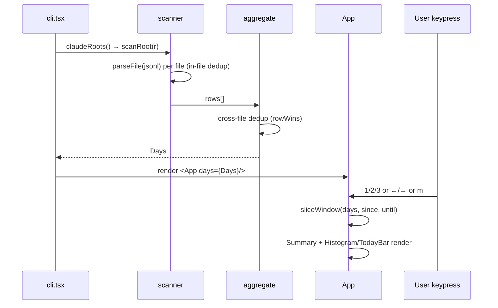

# High-Level Design

`oh-my-tokens` is a single-process Node CLI that scans local Claude Code JSONL session logs, computes per-day per-model token usage and USD cost, and renders an interactive Ink/React TUI with three time-window tabs.

## Architecture Overview

```mermaid
graph TD
    FS[~/.claude/projects/**/*.jsonl] --> SCAN[scanner.ts]
    ENV[CLAUDE_CONFIG_DIR] -.-> SCAN
    SCAN -->|Row[]| AGG[aggregate]
    AGG -->|Days| DATA[data.ts: sliceWindow]
    PRICE[pricing.ts: claudeCostUsd] --> SCAN
    DATA -->|WindowData| UI[ui/App.tsx]
    UI --> SUM[Summary.tsx]
    UI --> HIST[Histogram.tsx]
    UI --> TODAY[TodayBar.tsx]
    CLI[cli.tsx] --> SCAN
    CLI --> UI
```

## Components

- **pricing** — `src/pricing.ts`. Hardcoded `CLAUDE_PRICING` table, `normalizeClaudeModel()`, `claudeCostUsd()` with tiered (Sonnet 4.x 200k threshold) cost calc.
- **scanner** — `src/scanner.ts`. Discovers roots, walks `*.jsonl`, extracts `assistant`+`usage` rows, dedupes streaming chunks within and across files, aggregates `Days = day → model → bucket{input, cache_read, cache_create, output, cost}`.
- **data** — `src/data.ts`. UTC day helpers, `dateRange()`, `sliceWindow()` returning `WindowData` for a tab. (Thin module — folded into HLD; no own README.)
- **ui** — `src/ui/`. Ink/React components: `App` (tabs + key handler), `Summary`, `Histogram`, `TodayBar`, `colors.ts` (palette + format helpers).

## Key Design Decisions

- **No persistent cache** — every launch rescans all JSONL. Simpler than incremental parsing; fine at typical log sizes. See `rationale.md`.
- **Streaming dedup key = `messageId:requestId`** — collapses cumulative-usage chunks to one winning row. See `rationale.md`.
- **Cross-file tie-break**: prefer non-sidechain → parent over `subagents/` → lexicographic path. See `rationale.md`.
- **Sonnet 4.x tiered pricing per bucket** — 200k threshold applied per token bucket independently, not on the sum. See `rationale.md`.
- **Pure local computation** — no Anthropic API calls, works offline.

## Data Flow



## Cross-Cutting Concerns

- **Time:** all day keys are UTC `YYYY-MM-DD` from ISO-8601 timestamps; window math uses `setUTCDate`.
- **Errors:** scanner is forgiving — bad JSON lines, oversize lines (>512 KiB), unreadable files all silently skipped (not the user's data to fix).
- **Pricing fallback:** unknown model → `cost = null`, tokens still counted. New models require manual entry in `CLAUDE_PRICING`.
- **TTY requirement:** Ink needs raw mode; non-TTY runs print "Raw mode is not supported".

## Related Documents

- [Pricing](pricing/README.md)
- [Scanner](scanner/README.md)
- [UI](ui/README.md)
- [Rationale](rationale.md)
