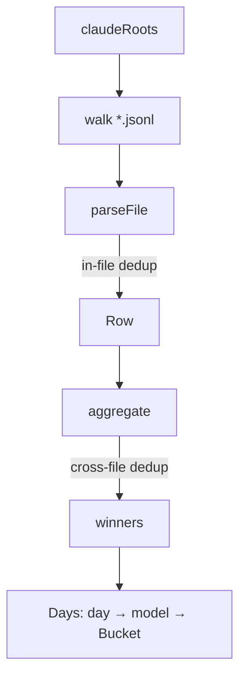

# Scanner

Discovers Claude Code log roots, walks all `*.jsonl` files, parses assistant turns with usage, dedupes streaming chunks, and aggregates rows into a `Days` map keyed by UTC date and normalized model.

## Responsibility

- **Discovery** — resolve `$CLAUDE_CONFIG_DIR` or fall back to `~/.config/claude/projects` and `~/.claude/projects`.
- **Parse** — read each JSONL line, filter to `assistant` rows with non-zero usage, normalize the model name, compute per-row cost.
- **Dedup** — collapse streaming chunks within a file (last write wins) and across files (deterministic tie-break).
- **Aggregate** — sum tokens and cost per `(day, model)` into the `Days` map consumed by the UI.

Does **not** slice windows (that's `data.ts`) or render anything (that's `ui/`).

## Architecture

## Key Files

- `src/scanner.ts` — entire component.

## Key Interfaces / Types

- `Row` — single parsed assistant turn (post in-file dedup) → `src/scanner.ts:7`
- `Bucket` — `{ input, cache_read, cache_create, output, cost }` → `src/scanner.ts:19`
- `Days = Record<string, Record<string, Bucket>>` → `src/scanner.ts:20`
- `claudeRoots(): string[]` → `src/scanner.ts:22`
- `parseFile(path: string): Row[]` → `src/scanner.ts:55`
- `aggregate(rows): Days` → `src/scanner.ts:115`
- `loadDays(): Days` — top-level entry → `src/scanner.ts:147`

## Line Filter

For each line in each `.jsonl`:

1. Skip if line size > 512 KiB (`MAX_LINE`).
2. Cheap byte-level prefilter — must contain both `"type":"assistant"` and `"usage"`.
3. JSON-parse. Require `type === "assistant"`, `timestamp` (ISO string), `message.model` (string), `message.usage` (object).

## Token Extraction

| `message.usage` field           | Bucket          |
| ------------------------------- | --------------- |
| `input_tokens`                  | `input`         |
| `cache_read_input_tokens`       | `cache_read`    |
| `cache_creation_input_tokens`   | `cache_create`  |
| `output_tokens`                 | `output`        |

Each value is `Math.max(0, n)`. If all four are zero, the row is dropped.

## Day Bucketing

`timestamp` parsed via `new Date()`, converted to UTC, sliced to `YYYY-MM-DD`. That key is used both for aggregation and for window slicing.

## Deduplication

### In-file (within `parseFile`)

- Key: `${messageId}:${requestId}`.
- Last write wins (final cumulative chunk).
- Lines without both ids are kept individually (`unkeyed`).

### Cross-file (in `aggregate`)

- Same canonical key across files.
- Tie-break order in `rowWins()`:
  1. Prefer non-`isSidechain` over sidechain.
  2. Prefer parent path over `subagent` path (`/subagents/` in path string).
  3. Lexicographically smaller file path.
- Rows lacking ids bypass dedup and are added directly.

See [Rationale](../rationale.md) for why streaming chunks must be deduped.

## Configuration

| Env var | Effect |
|---------|--------|
| `CLAUDE_CONFIG_DIR` | Comma-separated list of paths. Each entry is treated as either a `projects` directory or its parent. Empty → fallback to default home paths. |

## Dependencies

- **Internal:** `pricing.ts` (`normalizeClaudeModel`, `claudeCostUsd`).
- **External:** `node:fs`, `node:path`, `node:os` only.

## Error Handling

Forgiving by design — bad JSON lines, oversize lines, unreadable files, missing fields all skipped silently. Logs are not the user's data to repair; one bad line never blocks the rest.

## Related Documents

- [High-Level Design](../high-level-design.md)
- [Pricing](../pricing/README.md)
- [Rationale](../rationale.md)
