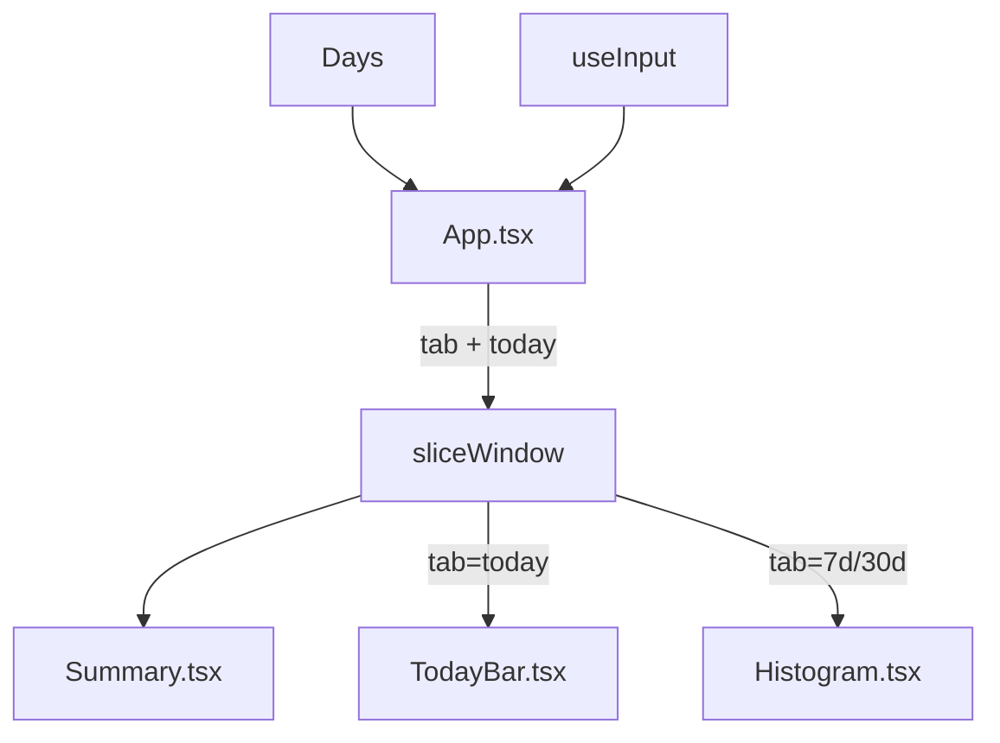

# UI

Ink/React TUI: tabbed view (Today / Last 7 days / Last 30 days) with a per-window summary table and a stacked-by-model bar chart. Toggle tokens ↔ cost with `m`.

## Responsibility

- Take a `Days` map from the scanner, slice it into a window per active tab, render summary + chart.
- Handle keyboard navigation (`1/2/3`, `←/→`, `m`, `q`/Esc).
- Map model names to a fixed color palette and format numbers (tokens → K/M/B, USD → `$X.XX`).

Does **not** scan logs, compute pricing, or write any state to disk.

## Architecture

## Key Files

- `src/cli.tsx` — entry: scan logs, `render(<App/>)`.
- `src/ui/App.tsx` — tab state, key handler, layout.
- `src/ui/Summary.tsx` — totals + per-model rows table.
- `src/ui/Histogram.tsx` — horizontal stacked bar per day (7d / 30d tabs).
- `src/ui/TodayBar.tsx` — single per-model breakdown bar (Today tab).
- `src/ui/colors.ts` — `PALETTE`, `modelColor()`, `fmtTokens()`, `fmtUsd()`.
- `src/data.ts` — `sliceWindow()`, `daysAgoUtc()`, `dateRange()`, `bucketTokens()`.

## Key Interfaces / Types

- `WindowData` — sliced view: `days[], perDay, models[], totals, perModelTotals` → `src/data.ts:25`
- `App({ days })` → `src/ui/App.tsx`
- `Histogram({ data, mode })` → `src/ui/Histogram.tsx`
- `TodayBar({ data, mode })` → `src/ui/TodayBar.tsx`

## Tabs and Windows

| Tab | Range | Renderer |
|-----|-------|----------|
| Today | `today..today` | `TodayBar` (per-model breakdown bar) |
| Last 7 days | `today-6 .. today` | `Histogram` |
| Last 30 days | `today-29 .. today` | `Histogram` |

## Keybindings

| Key | Action |
|-----|--------|
| `1` / `2` / `3` | Jump to tab |
| `←` / `→` | Cycle tabs |
| `m` | Toggle metric: tokens ↔ cost |
| `q` or Esc | Quit |

## Stacked Bar Math

`Histogram` and `TodayBar` both use largest-remainder allocation to keep total bar width = `BAR_WIDTH` exactly:

1. Compute exact float share per model (`tokens_or_cost / total * BAR_WIDTH`).
2. Floor each → integer segment lengths.
3. Distribute the rounding remainder to the largest fractional parts.

Empty trailing space in `Histogram` is filled with dim `·` characters.

## Color Palette

`PALETTE = ["cyan", "magenta", "yellow", "green", "blue", "red", "white", "gray"]`. Models are assigned by their order in `WindowData.models` (already sorted by tokens desc), so the dominant model always gets `cyan`.

## Dependencies

- **Internal:** `scanner.ts` (`Days`), `data.ts`.
- **External:** `ink`, `react`.

## Error Handling

- Empty window or zero total → renders "No usage in window." / "No usage today.".
- Non-TTY stdin → Ink prints `Raw mode is not supported` and aborts. No interactive fallback.

## Related Documents

- [High-Level Design](../high-level-design.md)
- [Scanner](../scanner/README.md)
